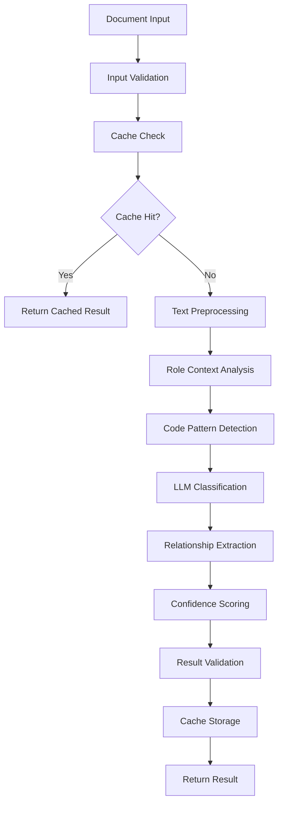
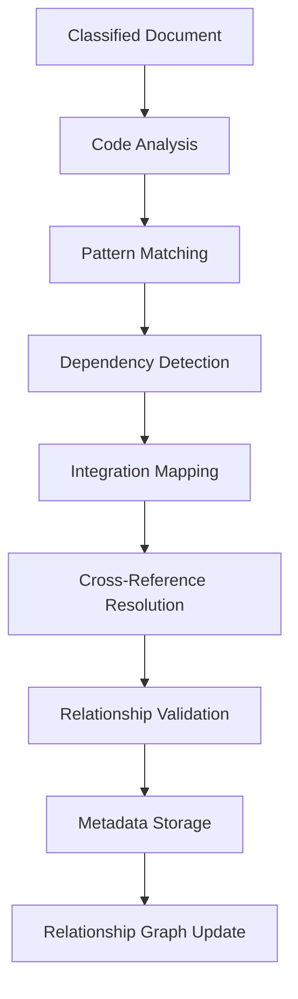

# RAG Classification Service - Comprehensive Project Brief

## 1. Project Overview

### 1.1 Purpose and Objectives

The `rag-classification` service is a dedicated microservice designed to provide sophisticated document classification capabilities for the RAG (Retrieval-Augmented Generation) ecosystem. This service addresses the critical need for intelligent, relationship-aware document categorization that enhances retrieval accuracy and supports code generation workflows.

**Primary Objectives:**
- Provide centralized, consistent classification across multiple RAG projects
- Implement relationship extraction for GraphRAG-like benefits without complexity
- Support role-specific classification optimized for different user personas
- Enable code-aware processing for technical documentation
- Deliver cost-efficient classification using modern LLM APIs

### 1.2 Position in the RAG Ecosystem

The service acts as the intelligence layer between document ingestion and retrieval, serving as a bridge component that:

- **Enhances rag-scraper**: Transforms basic post-scraping classification into sophisticated, relationship-aware categorization
- **Powers rag-server**: Provides per-chunk classification and relationship queries for improved retrieval
- **Enables future projects**: Offers a reusable classification foundation for new RAG implementations

### 1.3 Key Benefits and Value Proposition

**For Developers:**
- **Consistent Classification**: Single source of truth for document categorization across projects
- **Relationship Awareness**: Automatic extraction of dependencies, integrations, and prerequisites
- **Role Optimization**: Tailored classification for CODE, ARCHITECT, DEBUG, ORCHESTRATOR, and ASK roles
- **Code Intelligence**: WordPress-specific patterns, hook detection, and integration point mapping

**For System Architecture:**
- **Separation of Concerns**: Isolated classification logic with clear API boundaries
- **Scalability**: Independent scaling based on classification workload
- **Maintainability**: Centralized updates benefit all consuming projects
- **Cost Efficiency**: Optimized LLM usage with intelligent caching and fallback strategies

## 2. Technical Requirements

### 2.1 Relationship Extraction Capabilities

**Automated Relationship Detection:**
```yaml
Code Analysis Patterns:
  - Import/Require statements → dependency mapping
  - Function calls → integration point detection
  - Class extensions → inheritance relationships
  - Hook references → WordPress ecosystem connections

Documentation Markers:
  - @requires annotations → explicit dependencies
  - @see references → cross-document relationships
  - Prerequisites sections → learning path construction
  - Integration examples → system connection mapping
```

**Relationship Types:**
- `requires`: Technologies, plugins, concepts, documents
- `integrates_with`: APIs, systems, external services
- `extends`: Base functionality, enhancement patterns
- `related_to`: Similar topics, alternative approaches
- `prerequisites`: Required knowledge, setup steps

### 2.2 Code-Aware Processing

**WordPress-Specific Intelligence:**
- **Hook System Analysis**: Automatic detection of `add_action()`, `add_filter()`, and custom hooks
- **Plugin Architecture**: Recognition of plugin headers, namespace usage, and dependency declarations
- **Block Development**: Identification of Gutenberg blocks, `block.json` configurations, and React components
- **Theme Integration**: FSE patterns, `theme.json` structures, and template hierarchies

**Language-Specific Processing:**
- **PHP**: WordPress coding standards, security patterns, performance optimizations
- **JavaScript**: Block editor packages, React patterns, build tool requirements
- **CSS**: Block theme styling, custom properties, responsive patterns
- **JSON**: Configuration files, block definitions, theme specifications

### 2.3 Role-Specific Classification

**CODE Role Optimization:**
```yaml
Focus: Implementation-ready code with clear integration points
Classification Emphasis:
  - Production readiness indicators
  - Dependency requirements
  - Integration patterns
  - Code quality markers
  - Version compatibility
```

**ARCHITECT Role Optimization:**
```yaml
Focus: System design patterns and architectural decisions
Classification Emphasis:
  - Design patterns
  - System relationships
  - Architectural trade-offs
  - Scalability considerations
  - Technology choices
```

**DEBUG Role Optimization:**
```yaml
Focus: Troubleshooting and problem resolution
Classification Emphasis:
  - Error patterns
  - Diagnostic procedures
  - Common issues
  - Solution approaches
  - Debugging tools
```

**ORCHESTRATOR Role Optimization:**
```yaml
Focus: Multi-step processes and workflow coordination
Classification Emphasis:
  - Process workflows
  - Task dependencies
  - Progress tracking
  - Coordination patterns
  - Step-by-step guides
```

**ASK Role Optimization:**
```yaml
Focus: Reference documentation and learning resources
Classification Emphasis:
  - Concept explanations
  - Best practices
  - Learning paths
  - Reference materials
  - Educational content
```

### 2.4 Integration with Existing Projects

**rag-scraper Integration:**
- Batch processing of scraped documents
- Enhanced JSON output with relationship metadata
- Webhook notifications for classification completion
- Fallback to local classification if service unavailable

**rag-server Integration:**
- Per-chunk classification during document processing
- Relationship queries for dependency-aware retrieval
- Real-time classification for new content
- Integration with existing caching mechanisms

## 3. Architecture Design

### 3.1 Service Structure and Components

```yaml
rag-classification/
├── api/                           # REST API endpoints
│   ├── __init__.py
│   ├── main.py                   # FastAPI application
│   ├── routes/
│   │   ├── __init__.py
│   │   ├── classification.py     # Classification endpoints
│   │   ├── relationships.py      # Relationship queries
│   │   ├── health.py            # Health checks
│   │   └── batch.py             # Batch processing
│   └── middleware/
│       ├── __init__.py
│       ├── auth.py              # API authentication
│       ├── rate_limiting.py     # Rate limiting
│       └── logging.py           # Request logging
├── core/                         # Classification and relationship logic
│   ├── __init__.py
│   ├── classifier.py            # Main classification orchestrator
│   ├── relationship_extractor.py # Code dependency analysis
│   ├── role_classifier.py       # Role-specific classification
│   ├── code_analyzer.py         # Language-specific processing
│   ├── taxonomy_manager.py      # Classification schema management
│   └── confidence_scorer.py     # Classification quality assessment
├── models/                       # LLM orchestration and caching
│   ├── __init__.py
│   ├── llm_client.py            # Multi-provider LLM client
│   ├── deepseek_client.py       # DeepSeek V3 API client
│   ├── openrouter_client.py     # OpenRouter fallback client
│   ├── cache_manager.py         # Response caching
│   └── fallback_manager.py      # Model fallback logic
├── storage/                      # Relationship metadata and cache
│   ├── __init__.py
│   ├── relationship_store.py    # Relationship metadata storage
│   ├── classification_cache.py  # Classification result caching
│   └── metrics_store.py         # Performance metrics
├── config/                       # Classification schemas and rules
│   ├── __init__.py
│   ├── taxonomy.yaml            # Classification taxonomy
│   ├── relationship_patterns.yaml # Relationship extraction rules
│   ├── role_mappings.yaml       # Role-specific configurations
│   └── llm_config.yaml          # LLM provider configurations
├── utils/                        # Utility functions
│   ├── __init__.py
│   ├── text_processing.py       # Text preprocessing
│   ├── validation.py            # Input validation
│   └── monitoring.py            # Performance monitoring
├── tests/                        # Test suite
│   ├── __init__.py
│   ├── test_classification.py   # Classification tests
│   ├── test_relationships.py    # Relationship extraction tests
│   ├── test_api.py              # API endpoint tests
│   └── fixtures/                # Test data
├── memory-bank/                  # Project documentation
│   ├── productContext.md
│   ├── activeContext.md
│   ├── systemPatterns.md
│   ├── decisionLog.md
│   ├── progress.md
│   └── projectBrief.md          # This document
├── requirements.txt              # Python dependencies
├── Dockerfile                    # Container configuration
├── docker-compose.yml           # Local development setup
├── render.yaml                   # Render.com deployment config
└── README.md                     # Project documentation
```

### 3.2 API Endpoints and Integration Points

**Core Classification Endpoints:**
```yaml
POST /api/v1/classify/document
  Description: Classify a complete document with relationship extraction
  Input: Document content, metadata, role context
  Output: Classification result with relationships
  
POST /api/v1/classify/chunk
  Description: Classify a document chunk for real-time processing
  Input: Chunk content, parent document context
  Output: Chunk classification with preserved relationships

POST /api/v1/classify/batch
  Description: Batch process multiple documents
  Input: Array of documents, processing options
  Output: Array of classification results
```

**Relationship Query Endpoints:**
```yaml
GET /api/v1/relationships/{document_id}
  Description: Retrieve relationship metadata for a document
  Output: Complete relationship graph for the document

GET /api/v1/relationships/dependencies/{document_id}
  Description: Get dependency chain for a document
  Output: Ordered list of prerequisites and dependencies

POST /api/v1/relationships/query
  Description: Query relationships by criteria
  Input: Relationship filters, search parameters
  Output: Matching relationships and connected documents
```

**System Management Endpoints:**
```yaml
GET /api/v1/health
  Description: Service health check
  Output: Service status, model availability, cache status

GET /api/v1/metrics
  Description: Classification performance metrics
  Output: Processing statistics, accuracy metrics, cost tracking

POST /api/v1/cache/clear
  Description: Clear classification cache
  Input: Cache scope (all, specific patterns)
  Output: Cache clearing confirmation
```

### 3.3 Data Flow and Processing Pipeline

**Document Classification Flow:**


**Relationship Extraction Pipeline:**


## 4. Implementation Specifications

### 4.1 Technology Stack

**Core Framework:**
- **Python 3.9+**: Primary development language
- **FastAPI**: REST API framework with automatic documentation
- **Pydantic**: Data validation and serialization
- **SQLite/PostgreSQL**: Relationship metadata storage
- **Redis**: Classification result caching

**LLM Integration:**
- **DeepSeek V3 API**: Primary classification model (cost-efficient)
- **OpenRouter**: Fallback model access (GPT-4.5, Claude)
- **httpx**: Async HTTP client for API calls
- **tenacity**: Retry logic and error handling

**Development Tools:**
- **pytest**: Testing framework
- **black**: Code formatting
- **flake8**: Code linting
- **mypy**: Type checking
- **pre-commit**: Git hooks for quality assurance

### 4.2 LLM Integration Strategy

**Primary Model: DeepSeek V3 API**
```yaml
Rationale: Cost-efficient approach with excellent technical understanding
Pricing: $0.27 input / $1.10 output per 1M tokens
Benefits:
  - 95% cost savings vs premium models
  - Strong performance on code and documentation
  - Excellent technical pattern recognition
  - Suitable for high-volume classification
```

**Fallback Strategy:**
```yaml
Tier 1: DeepSeek V3 API (primary)
Tier 2: GPT-4.5 via OpenRouter (complex cases)
Tier 3: Claude 4 Sonnet (critical documents)
Tier 4: Local classification (service unavailable)
```

**Cost Optimization:**
- Intelligent caching with 30-day TTL
- Batch processing for efficiency
- Confidence-based model selection
- Rate limiting to prevent cost spikes

### 4.3 Caching and Performance Optimization

**Multi-Level Caching Strategy:**
```yaml
Level 1: In-Memory Cache (Redis)
  - Classification results
  - Relationship metadata
  - Frequently accessed patterns
  - TTL: 1 hour for active content

Level 2: Persistent Cache (SQLite/PostgreSQL)
  - Long-term classification storage
  - Relationship graphs
  - Performance metrics
  - TTL: 30 days with LRU eviction

Level 3: Content-Based Caching
  - Hash-based document fingerprinting
  - Incremental updates for modified content
  - Version-aware cache invalidation
```

**Performance Optimizations:**
- Async processing for concurrent requests
- Connection pooling for database access
- Batch processing for multiple documents
- Streaming responses for large datasets
- Background processing for non-critical tasks

### 4.4 Error Handling and Fallback Mechanisms

**Graceful Degradation:**
```yaml
LLM Service Unavailable:
  - Return cached results if available
  - Use simplified rule-based classification
  - Queue requests for later processing
  - Notify consuming services of degraded mode

Classification Confidence Low:
  - Escalate to higher-tier model
  - Request human review for critical documents
  - Apply conservative default classifications
  - Log for quality improvement analysis

Relationship Extraction Failure:
  - Return classification without relationships
  - Use pattern-based relationship detection
  - Mark for manual relationship review
  - Continue with core classification functionality
```

**Error Recovery:**
- Exponential backoff for API retries
- Circuit breaker pattern for failing services
- Health check endpoints for monitoring
- Automatic failover to backup models

## 5. Integration Requirements

### 5.1 rag-scraper Integration

**Batch Processing Integration:**
```yaml
Endpoint: POST /api/v1/classify/batch
Integration Pattern:
  - rag-scraper calls classification service after scraping
  - Processes documents in configurable batch sizes
  - Receives enhanced JSON with relationship metadata
  - Updates local document storage with classifications

Enhanced JSON Output:
  {
    "content": "...",
    "title": "...",
    "source": "...",
    "classification": {
      "collection": "wordpress_block_development",
      "topics": ["Real Estate Blocks", "Property Listing", ...],
      "tags": ["production-ready", "dynamic-block", ...],
      "confidence": 0.95
    },
    "relationships": {
      "requires": ["MW Properties 2.0+", "WordPress 6.8+"],
      "integrates_with": ["REST API", "Block Editor"],
      "related_to": ["property-templates", "search-forms"]
    }
  }
```

**Fallback Mechanism:**
```python
# rag-scraper integration with fallback
try:
    classification_result = await classification_service.classify_batch(documents)
    enhanced_documents = merge_classifications(documents, classification_result)
except ClassificationServiceError:
    logger.warning("Classification service unavailable, using local fallback")
    enhanced_documents = local_classify_fallback(documents)
```

### 5.2 rag-server Integration

**Per-Chunk Classification:**
```yaml
Endpoint: POST /api/v1/classify/chunk
Integration Pattern:
  - Called during document processing pipeline
  - Provides chunk-level classification for retrieval
  - Maintains relationship context across chunks
  - Supports streaming for large documents

Real-time Processing:
  - Async classification during document ingestion
  - Immediate availability for retrieval queries
  - Background relationship graph updates
  - Cache warming for related content
```

**Relationship Queries:**
```yaml
Endpoint: GET /api/v1/relationships/{document_id}
Use Cases:
  - Dependency-aware retrieval
  - Related document suggestions
  - Learning path construction
  - Integration point discovery

Query Enhancement:
  - Expand queries with related terms
  - Include prerequisite documents
  - Surface integration examples
  - Provide context-aware results
```

### 5.3 API Specifications for Both Consumers

**Authentication:**
```yaml
Method: API Key Authentication
Header: X-API-Key: {service_api_key}
Rate Limiting: 1000 requests/hour per key
Monitoring: Request logging and usage tracking
```

**Request/Response Format:**
```yaml
Content-Type: application/json
Error Format:
  {
    "error": "classification_failed",
    "message": "Detailed error description",
    "code": 4001,
    "retry_after": 60
  }

Success Format:
  {
    "status": "success",
    "data": { ... },
    "metadata": {
      "processing_time": 1.23,
      "model_used": "deepseek-v3",
      "confidence": 0.95
    }
  }
```

## 6. Classification Schema

### 6.1 Collections, Topics, Tags Structure

**Collections (Technology Domains):**
```yaml
wordpress_block_development:
  description: Gutenberg blocks, patterns, block.json configurations
  
wordpress_theme_development:
  description: FSE themes, theme.json, templates, patterns
  
wordpress_plugin_development:
  description: Plugin architecture, hooks, APIs, integrations
  
mw_properties_integration:
  description: MW Properties plugin integration patterns
  
acf_to_blocks_migration:
  description: ACF field conversion to block patterns
  
legacy_theme_migration:
  description: Traditional theme to FSE migration patterns
```

**Topic Hierarchy (4-Level Structure):**
```yaml
Level 1: Feature Category (e.g., "Property Display")
Level 2: Implementation Type (e.g., "Block Development")
Level 3: Specific Pattern (e.g., "Dynamic Property Block")
Level 4: Code Variant (e.g., "Single Property Display")
```

**Tag Categories:**
```yaml
Readiness Levels:
  - production-ready
  - requires-modification
  - example-code
  - starter-template

WordPress Features:
  - dynamic-block
  - static-block
  - block-pattern
  - fse-template
  - theme-json

Integration Requirements:
  - requires-mw-properties
  - requires-acf
  - requires-build
  - standalone

Version Compatibility:
  - wp-6.8+
  - wp-6.0+
  - php-8.0+
  - mysql-8.0+
```

### 6.2 Relationship Extraction Patterns

**Code Analysis Patterns:**
```yaml
Import Statements:
  Pattern: "use MW_Properties\\*"
  Relationship: requires MW Properties namespace
  
Function Calls:
  Pattern: "add_action('mw_properties_*')"
  Relationship: integrates with MW Properties hooks
  
Class Extensions:
  Pattern: "extends WP_Widget"
  Relationship: extends WordPress core functionality
  
Hook References:
  Pattern: "apply_filters('theme_*')"
  Relationship: provides extension point
```

**Documentation Markers:**
```yaml
Explicit Requirements:
  Pattern: "@requires WordPress 5.0+"
  Relationship: requires specific version
  
Cross-References:
  Pattern: "@see other_function()"
  Relationship: related implementation
  
Prerequisites:
  Pattern: "Before using this, understand..."
  Relationship: prerequisite knowledge
```

### 6.3 Role-Optimized Classification Approaches

**CODE Role Classification:**
```yaml
Emphasis:
  - Implementation details and code quality
  - Dependency requirements and integration points
  - Production readiness and testing status
  - Performance and security considerations

Example Output:
  collection: wordpress_block_development
  topics: ["Property Features", "Dynamic Blocks", "Property Grid", "With Filtering"]
  tags: ["production-ready", "dynamic-block", "mw-properties-integration", "ajax-filtering"]
  relationships:
    requires: ["MW Properties 2.0+", "WordPress 6.8+"]
    integrates_with: ["REST API", "Block Editor"]
```

**ARCHITECT Role Classification:**
```yaml
Emphasis:
  - System design patterns and architectural decisions
  - Technology choices and trade-offs
  - Scalability and maintainability considerations
  - Integration patterns and data flow

Example Output:
  collection: wordpress_theme_development
  topics: ["Theme Architecture", "FSE Structure", "Template Hierarchy"]
  tags: ["architecture-pattern", "fse-theme", "design-decision"]
  relationships:
    extends: ["Twenty Twenty-Five base theme"]
    design_patterns: ["separation-of-concerns", "template-hierarchy"]
```

## 7. Development Phases

### 7.1 Phase 1: Foundation (Weeks 1-2)

**Objectives:**
- Establish service skeleton with basic API
- Migrate existing rag-server classifier logic
- Implement basic relationship extraction
- Deploy to Render.com

**Deliverables:**
```yaml
Core Infrastructure:
  - FastAPI application with health endpoints
  - Basic classification API (/classify/document)
  - DeepSeek V3 API integration
  - SQLite-based storage for development

Migrated Functionality:
  - Document preprocessing from rag-server
  - LLM client abstraction
  - Basic caching mechanism
  - Error handling and logging

Basic Relationship Extraction:
  - Regex-based pattern detection
  - Simple dependency mapping
  - WordPress hook identification
  - Integration point discovery

Deployment:
  - Render.com service configuration
  - Environment variable management
  - Basic monitoring and health checks
  - CI/CD pipeline setup
```

### 7.2 Phase 2: Enhancement (Weeks 3-4)

**Objectives:**
- Add role-specific classification routing
- Implement code-aware processing
- Enhanced relationship extraction
- Performance optimization

**Deliverables:**
```yaml
Role-Specific Classification:
  - Role detection from request context
  - Customized prompts for each role
  - Role-optimized tag selection
  - Confidence scoring per role

Code-Aware Processing:
  - WordPress hook system analysis
  - Plugin architecture detection
  - Block development pattern recognition
  - Theme integration identification

Enhanced Relationships:
  - Multi-level dependency analysis
  - Integration point mapping
  - Cross-reference resolution
  - Relationship validation

Performance Improvements:
  - Redis caching integration
  - Batch processing optimization
  - Async request handling
  - Connection pooling
```

### 7.3 Phase 3: Integration (Weeks 5-6)

**Objectives:**
- Integrate rag-scraper workflow
- Update rag-server to use rag-classification
- Performance optimization and monitoring
- Production readiness

**Deliverables:**
```yaml
rag-scraper Integration:
  - Batch classification endpoint
  - Enhanced JSON output format
  - Webhook notification system
  - Fallback mechanism implementation

rag-server Integration:
  - Per-chunk classification API
  - Relationship query endpoints
  - Real-time processing pipeline
  - Cache integration

Production Features:
  - Comprehensive monitoring
  - Performance metrics collection
  - Error tracking and alerting
  - Load testing and optimization

Quality Assurance:
  - Automated testing suite
  - Classification accuracy validation
  - Performance benchmarking
  - Security audit
```

### 7.4 Phase 4: Advanced Features (Weeks 7-8)

**Objectives:**
- Dependency-aware retrieval algorithms
- Classification quality monitoring
- Advanced relationship features
- Production optimization

**Deliverables:**
```yaml
Advanced Retrieval:
  - Dependency-aware query expansion
  - Learning path construction
  - Context-sensitive recommendations
  - Integration-aware search

Quality Monitoring:
  - Classification accuracy tracking
  - Confidence score analysis
  - Model performance comparison
  - Quality improvement recommendations

Advanced Relationships:
  - Circular dependency detection
  - Version compatibility checking
  - Integration conflict identification
  - Relationship graph visualization

Production Optimization:
  - Cost optimization strategies
  - Scaling configuration
  - Performance tuning
  - Monitoring dashboard
```

## 8. Deployment and Operations

### 8.1 Render.com Deployment Configuration

**Service Configuration:**
```yaml
# render.yaml
services:
  - type: web
    name: rag-classification
    env: python
    plan: starter  # Free tier initially
    buildCommand: pip install -r requirements.txt
    startCommand: uvicorn api.main:app --host 0.0.0.0 --port $PORT
    envVars:
      - key: DEEPSEEK_API_KEY
        sync: false
      - key: OPENROUTER_API_KEY
        sync: false
      - key: REDIS_URL
        fromService:
          type: redis
          name: rag-classification-cache
      - key: DATABASE_URL
        fromDatabase:
          name: rag-classification-db
          property: connectionString

  - type: redis
    name: rag-classification-cache
    plan: starter  # Free tier
    maxmemoryPolicy: allkeys-lru

databases:
  - name: rag-classification-db
    databaseName: rag_classification
    user: rag_user
    plan: starter  # Free tier PostgreSQL
```

**Dockerfile:**
```dockerfile
FROM python:3.9-slim

WORKDIR /app

COPY requirements.txt .
RUN pip install --no-cache-dir -r requirements.txt

COPY . .

EXPOSE 8000

CMD ["uvicorn", "api.main:app", "--host", "0.0.0.0", "--port", "8000"]
```

### 8.2 Environment Variables and Configuration Management

**Required Environment Variables:**
```yaml
# LLM API Configuration
DEEPSEEK_API_KEY: Primary model API key
OPENROUTER_API_KEY: Fallback model access
LLM_TIMEOUT: Request timeout (default: 30s)
LLM_MAX_RETRIES: Retry attempts (default: 3)

# Database Configuration
DATABASE_URL: PostgreSQL connection string
REDIS_URL: Redis cache connection string

# Service Configuration
API_KEY: Service authentication key
RATE_LIMIT_PER_HOUR: Request rate limit (default: 1000)
CACHE_TTL_HOURS: Cache expiration (default: 24)
BATCH_SIZE_LIMIT: Maximum batch size (default: 50)

# Monitoring and Logging
LOG_LEVEL: Logging verbosity (default: INFO)
SENTRY_DSN: Error tracking (optional)
METRICS_ENABLED: Performance metrics (default: true)
```

**Configuration Management:**
```python
# config/settings.py
from pydantic import BaseSettings
from typing import Optional

class Settings(BaseSettings):
    # LLM Configuration
    deepseek_api_key: str
    openrouter_api_key: str
    llm_timeout: int = 30
    llm_max_retries: int = 3
    
    # Database Configuration
    database_url: str
    redis_url: str
    
    # Service Configuration
    api_key: str
    rate_limit_per_hour: int = 1000
    cache_ttl_hours: int = 24
    batch_size_limit: int = 50
    
    # Monitoring
    log_level: str = "INFO"
    sentry_dsn: Optional[str] = None
    metrics_enabled: bool = True
    
    class Config:
        env_file = ".env"

settings = Settings()
```

### 8.3 Monitoring and Health Checks

**Health Check Endpoints:**
```python
# api/routes/health.py
from fastapi import APIRouter
from core.classifier import ClassificationService
from models.llm_client import LLMClient
from storage.relationship_store import RelationshipStore

router = APIRouter()

@router.get("/health")
async def health_check():
    """Basic health check"""
    return {"status": "healthy", "timestamp": datetime.utcnow()}

@router.get("/health/detailed")
async def detailed_health_check():
    """Comprehensive health check"""
    checks = {
        "database": await check_database_connection(),
        "redis": await check_redis_connection(),
        "llm_primary": await check_deepseek_api(),
        "llm_fallback": await check_openrouter_api(),
        "storage": await check_storage_health()
    }
    
    overall_status = "healthy" if all(checks.values()) else "degraded"
    
    return {
        "status": overall_status,
        "checks": checks,
        "timestamp": datetime.utcnow()
    }
```

**Performance Monitoring:**
```python
# utils/monitoring.py
import time
from functools import wraps
from prometheus_client import Counter, Histogram, Gauge

# Metrics
classification_requests = Counter('classification_requests_total', 'Total classification requests', ['model', 'status'])
classification_duration = Histogram('classification_duration_seconds', 'Classification processing time')
active_connections = Gauge('active_connections', 'Active database connections')
cache_hit_rate = Gauge('cache_hit_rate', 'Cache hit rate percentage')

def monitor_classification(func):
    @wraps(func)
    async def wrapper(*args, **kwargs):
        start_time = time.time()
        try:
            result = await func(*args, **kwargs)
            classification_requests.labels(model=result.get('model_used', 'unknown'), status='success').inc()
            return result
        except Exception as e:
            classification_requests.labels(model='unknown', status='error').inc()
            raise
        finally:
            classification_duration.observe(time.time() - start_time)
    return wrapper
```

### 8.4 Scaling Considerations

**Horizontal Scaling:**
```yaml
Render.com Scaling:
  - Start with Starter plan (free tier)
  - Scale to Standard plan for production load
  - Use Professional plan for high availability
  - Consider multiple regions for global deployment

Load Balancing:
  - Render.com provides automatic load balancing
  - Stateless service design for easy scaling
  - Session affinity not required
  - Health check-based routing
```

**Vertical Scaling:**
```yaml
Resource Optimization:
  - Monitor CPU and memory usage
  - Optimize batch processing sizes
  - Tune database connection pools
  - Adjust cache memory allocation

Performance Tuning:
  - Async processing for I/O operations
  - Connection pooling for external APIs
  - Efficient caching strategies
  - Background task processing
```

**Cost Management:**
```yaml
Free Tier Optimization:
  - Efficient use of 750 hours/month
  - Intelligent service sleeping
  - Batch processing during off-peak
  - Cache optimization to reduce API calls

Scaling Triggers:
  - Response time > 2 seconds
  - Error rate > 1%
  - CPU usage > 80%
  - Memory usage > 85%
```

## 9. Quality Assurance

### 9.1 Testing Strategy

**Unit Testing:**
```python
# tests/test_classification.py
import pytest
from core.classifier import DocumentClassifier
from core.relationship_extractor import RelationshipExtractor

class TestDocumentClassifier:
    @pytest.fixture
    def classifier(self):
        return DocumentClassifier(test_config)
    
    @pytest.mark.asyncio
    async def test_wordpress_block_classification(self, classifier):
        document = {
            "content": "function register_property_block() { wp_register_block_type(...) }",
            "title": "Property Block Registration",
            "source": "wordpress_blocks"
        }
        
        result = await classifier.classify_document(document)
        
        assert result["collection"] == "wordpress_block_development"
        assert "dynamic-block" in result["tags"]
        assert result["confidence"] > 0.8

    @pytest.mark.asyncio
    async def test_relationship_extraction(self, classifier):
        document = {
            "content": "use MW_Properties\\API; add_action('mw_properties_init', 'setup_blocks');",
            "title": "MW Properties Integration"
        }
        
        result = await classifier.classify_

        assert result["relationships"]["requires"]
        assert "MW_Properties" in str(result["relationships"]["requires"])

class TestRelationshipExtractor:
    @pytest.fixture
    def extractor(self):
        return RelationshipExtractor()
    
    def test_wordpress_hook_detection(self, extractor):
        code = "add_action('mw_properties_init', 'setup_blocks');"
        relationships = extractor.extract_relationships(code)
        
        assert "integrates_with" in relationships
        assert "mw_properties_init" in relationships["integrates_with"]
    
    def test_dependency_extraction(self, extractor):
        code = "use MW_Properties\\API\\PropertyManager;"
        relationships = extractor.extract_relationships(code)
        
        assert "requires" in relationships
        assert "MW_Properties" in str(relationships["requires"])
```

**Integration Testing:**
```python
# tests/test_api.py
import pytest
from fastapi.testclient import TestClient
from api.main import app

client = TestClient(app)

class TestClassificationAPI:
    def test_classify_document_endpoint(self):
        document = {
            "content": "Sample WordPress block code",
            "title": "Test Block",
            "source": "wordpress_blocks",
            "role": "CODE"
        }
        
        response = client.post("/api/v1/classify/document", json=document)
        
        assert response.status_code == 200
        result = response.json()
        assert "classification" in result
        assert "relationships" in result
        assert result["classification"]["confidence"] > 0.0
    
    def test_batch_classification(self):
        documents = [
            {"content": "Block code 1", "title": "Block 1"},
            {"content": "Block code 2", "title": "Block 2"}
        ]
        
        response = client.post("/api/v1/classify/batch", json={"documents": documents})
        
        assert response.status_code == 200
        results = response.json()
        assert len(results["data"]) == 2
    
    def test_health_check(self):
        response = client.get("/api/v1/health")
        
        assert response.status_code == 200
        assert response.json()["status"] == "healthy"
```

### 9.2 Classification Quality Metrics

**Accuracy Measurement:**
```python
# utils/quality_metrics.py
from typing import Dict, List
import json

class ClassificationQualityMetrics:
    def __init__(self):
        self.metrics = {
            "total_classifications": 0,
            "confidence_distribution": {},
            "collection_accuracy": {},
            "relationship_accuracy": {},
            "model_performance": {}
        }
    
    def record_classification(self, result: Dict, ground_truth: Dict = None):
        """Record classification result for quality tracking"""
        self.metrics["total_classifications"] += 1
        
        # Track confidence distribution
        confidence = result.get("confidence", 0.0)
        confidence_bucket = f"{int(confidence * 10) * 10}-{int(confidence * 10) * 10 + 10}%"
        self.metrics["confidence_distribution"][confidence_bucket] = \
            self.metrics["confidence_distribution"].get(confidence_bucket, 0) + 1
        
        # Track model performance
        model = result.get("model_used", "unknown")
        if model not in self.metrics["model_performance"]:
            self.metrics["model_performance"][model] = {
                "count": 0,
                "avg_confidence": 0.0,
                "total_confidence": 0.0
            }
        
        model_stats = self.metrics["model_performance"][model]
        model_stats["count"] += 1
        model_stats["total_confidence"] += confidence
        model_stats["avg_confidence"] = model_stats["total_confidence"] / model_stats["count"]
        
        # If ground truth available, calculate accuracy
        if ground_truth:
            self._calculate_accuracy(result, ground_truth)
    
    def _calculate_accuracy(self, result: Dict, ground_truth: Dict):
        """Calculate accuracy against ground truth"""
        collection_match = result.get("collection") == ground_truth.get("collection")
        if collection_match:
            collection = result.get("collection", "unknown")
            self.metrics["collection_accuracy"][collection] = \
                self.metrics["collection_accuracy"].get(collection, 0) + 1
    
    def get_quality_report(self) -> Dict:
        """Generate comprehensive quality report"""
        return {
            "summary": {
                "total_classifications": self.metrics["total_classifications"],
                "average_confidence": self._calculate_average_confidence(),
                "most_used_model": self._get_most_used_model()
            },
            "confidence_distribution": self.metrics["confidence_distribution"],
            "model_performance": self.metrics["model_performance"],
            "collection_accuracy": self.metrics["collection_accuracy"]
        }
    
    def _calculate_average_confidence(self) -> float:
        """Calculate overall average confidence"""
        total_confidence = 0.0
        total_count = 0
        
        for model_stats in self.metrics["model_performance"].values():
            total_confidence += model_stats["total_confidence"]
            total_count += model_stats["count"]
        
        return total_confidence / total_count if total_count > 0 else 0.0
    
    def _get_most_used_model(self) -> str:
        """Get the most frequently used model"""
        if not self.metrics["model_performance"]:
            return "none"
        
        return max(
            self.metrics["model_performance"].items(),
            key=lambda x: x[1]["count"]
        )[0]
```

### 9.3 Performance Benchmarks

**Response Time Targets:**
```yaml
Classification Performance:
  Single Document: < 2 seconds (95th percentile)
  Batch Processing: < 5 seconds per document (average)
  Relationship Extraction: < 1 second additional overhead
  Cache Hit Response: < 100ms

Throughput Targets:
  Concurrent Requests: 10 requests/second sustained
  Daily Volume: 10,000 classifications
  Peak Load: 50 requests/second for 5 minutes
  Batch Size: Up to 50 documents per batch

Resource Utilization:
  CPU Usage: < 70% average, < 90% peak
  Memory Usage: < 512MB average, < 1GB peak
  Database Connections: < 10 concurrent
  Cache Hit Rate: > 80%
```

**Performance Testing:**
```python
# tests/test_performance.py
import asyncio
import time
import pytest
from core.classifier import DocumentClassifier

class TestPerformance:
    @pytest.mark.asyncio
    async def test_single_document_performance(self):
        classifier = DocumentClassifier()
        document = {
            "content": "Sample WordPress block code with hooks and integrations",
            "title": "Performance Test Block"
        }
        
        start_time = time.time()
        result = await classifier.classify_document(document)
        end_time = time.time()
        
        processing_time = end_time - start_time
        assert processing_time < 2.0, f"Classification took {processing_time}s, expected < 2s"
        assert result["confidence"] > 0.0
    
    @pytest.mark.asyncio
    async def test_concurrent_requests(self):
        classifier = DocumentClassifier()
        documents = [
            {"content": f"Test document {i}", "title": f"Doc {i}"}
            for i in range(10)
        ]
        
        start_time = time.time()
        tasks = [classifier.classify_document(doc) for doc in documents]
        results = await asyncio.gather(*tasks)
        end_time = time.time()
        
        total_time = end_time - start_time
        avg_time_per_doc = total_time / len(documents)
        
        assert len(results) == 10
        assert avg_time_per_doc < 5.0, f"Average time {avg_time_per_doc}s, expected < 5s"
        assert all(r["confidence"] > 0.0 for r in results)
    
    @pytest.mark.asyncio
    async def test_cache_performance(self):
        classifier = DocumentClassifier()
        document = {
            "content": "Cached document test",
            "title": "Cache Test"
        }
        
        # First request (cache miss)
        start_time = time.time()
        result1 = await classifier.classify_document(document)
        first_request_time = time.time() - start_time
        
        # Second request (cache hit)
        start_time = time.time()
        result2 = await classifier.classify_document(document)
        second_request_time = time.time() - start_time
        
        assert result1 == result2
        assert second_request_time < 0.1, f"Cache hit took {second_request_time}s, expected < 0.1s"
        assert second_request_time < first_request_time / 10  # At least 10x faster
```

### 9.4 Fallback and Error Handling

**Error Handling Strategy:**
```python
# core/error_handling.py
from enum import Enum
from typing import Dict, Optional
import logging

class ClassificationError(Exception):
    """Base exception for classification errors"""
    pass

class LLMServiceError(ClassificationError):
    """LLM service unavailable or failed"""
    pass

class ValidationError(ClassificationError):
    """Input validation failed"""
    pass

class ConfidenceError(ClassificationError):
    """Classification confidence too low"""
    pass

class ErrorSeverity(Enum):
    LOW = "low"
    MEDIUM = "medium"
    HIGH = "high"
    CRITICAL = "critical"

class ErrorHandler:
    def __init__(self):
        self.logger = logging.getLogger(__name__)
        self.fallback_strategies = {
            LLMServiceError: self._handle_llm_service_error,
            ValidationError: self._handle_validation_error,
            ConfidenceError: self._handle_confidence_error
        }
    
    async def handle_error(self, error: Exception, context: Dict) -> Optional[Dict]:
        """Handle classification errors with appropriate fallback strategies"""
        error_type = type(error)
        severity = self._determine_severity(error)
        
        self.logger.error(
            f"Classification error: {error_type.__name__}: {str(error)}",
            extra={"context": context, "severity": severity.value}
        )
        
        if error_type in self.fallback_strategies:
            return await self.fallback_strategies[error_type](error, context)
        
        # Generic fallback
        return await self._generic_fallback(error, context)
    
    async def _handle_llm_service_error(self, error: LLMServiceError, context: Dict) -> Optional[Dict]:
        """Handle LLM service failures"""
        # Try fallback model
        try:
            from models.llm_client import LLMClient
            fallback_client = LLMClient(model="gpt-4o-mini")  # Cheaper fallback
            return await fallback_client.classify(context["document"])
        except Exception as fallback_error:
            self.logger.error(f"Fallback model also failed: {fallback_error}")
            return await self._rule_based_fallback(context)
    
    async def _handle_validation_error(self, error: ValidationError, context: Dict) -> Optional[Dict]:
        """Handle input validation errors"""
        # Attempt to clean and retry
        cleaned_document = self._clean_document(context["document"])
        if cleaned_document:
            try:
                from core.classifier import DocumentClassifier
                classifier = DocumentClassifier()
                return await classifier.classify_document(cleaned_document)
            except Exception:
                pass
        
        return None  # Cannot recover from validation errors
    
    async def _handle_confidence_error(self, error: ConfidenceError, context: Dict) -> Optional[Dict]:
        """Handle low confidence classifications"""
        # Try with a more powerful model
        try:
            from models.llm_client import LLMClient
            premium_client = LLMClient(model="claude-3-sonnet")
            return await premium_client.classify(context["document"])
        except Exception:
            # Return low-confidence result with warning
            result = context.get("partial_result", {})
            result["confidence_warning"] = True
            result["confidence"] = max(result.get("confidence", 0.0), 0.3)  # Minimum confidence
            return result
    
    async def _rule_based_fallback(self, context: Dict) -> Dict:
        """Simple rule-based classification when LLMs fail"""
        document = context["document"]
        content = document.get("content", "").lower()
        title = document.get("title", "").lower()
        
        # Simple keyword-based classification
        if any(keyword in content or keyword in title for keyword in ["block", "gutenberg", "wp_register_block"]):
            return {
                "collection": "wordpress_block_development",
                "topics": ["Block Development", "General", "Unknown", "Fallback"],
                "tags": ["fallback-classification", "requires-review"],
                "confidence": 0.3,
                "model_used": "rule-based-fallback",
                "relationships": {}
            }
        elif any(keyword in content or keyword in title for keyword in ["theme", "template", "fse"]):
            return {
                "collection": "wordpress_theme_development",
                "topics": ["Theme Development", "General", "Unknown", "Fallback"],
                "tags": ["fallback-classification", "requires-review"],
                "confidence": 0.3,
                "model_used": "rule-based-fallback",
                "relationships": {}
            }
        else:
            return {
                "collection": "general_documentation",
                "topics": ["General", "Unknown", "Fallback", "Unclassified"],
                "tags": ["fallback-classification", "requires-review", "manual-classification-needed"],
                "confidence": 0.1,
                "model_used": "rule-based-fallback",
                "relationships": {}
            }
    
    def _clean_document(self, document: Dict) -> Optional[Dict]:
        """Attempt to clean malformed document data"""
        try:
            cleaned = {
                "content": str(document.get("content", ""))[:10000],  # Truncate long content
                "title": str(document.get("title", ""))[:200],  # Truncate long titles
                "source": str(document.get("source", "unknown")),
                "metadata": document.get("metadata", {})
            }
            
            # Ensure minimum content length
            if len(cleaned["content"]) < 10:
                return None
            
            return cleaned
        except Exception:
            return None
    
    def _determine_severity(self, error: Exception) -> ErrorSeverity:
        """Determine error severity for monitoring and alerting"""
        if isinstance(error, ValidationError):
            return ErrorSeverity.LOW
        elif isinstance(error, ConfidenceError):
            return ErrorSeverity.MEDIUM
        elif isinstance(error, LLMServiceError):
            return ErrorSeverity.HIGH
        else:
            return ErrorSeverity.CRITICAL
```

## 10. Success Metrics

### 10.1 Classification Accuracy Improvements

**Baseline Metrics (Current State):**
```yaml
rag-scraper Classification:
  - Basic taxonomy accuracy: ~70%
  - Relationship extraction: 0% (not implemented)
  - Role-specific optimization: 0% (not implemented)
  - Code-aware processing: ~30% (basic patterns only)

rag-server Classification:
  - Document-level accuracy: ~75%
  - Chunk-level consistency: ~60%
  - Integration awareness: ~40%
  - Dependency detection: ~20%
```

**Target Improvements:**
```yaml
rag-classification Service:
  - Overall classification accuracy: >90%
  - Relationship extraction accuracy: >85%
  - Role-specific relevance: >95%
  - Code-aware processing: >90%
  - Cross-project consistency: >95%

Quality Metrics:
  - Confidence score reliability: >90%
  - False positive rate: <5%
  - False negative rate: <10%
  - Manual review requirement: <15%
```

### 10.2 Integration Success with Both Projects

**rag-scraper Integration Metrics:**
```yaml
Performance Targets:
  - Batch processing time: <5 seconds per document
  - Enhanced JSON generation: 100% success rate
  - Fallback activation: <5% of requests
  - Service availability: >99.5%

Quality Targets:
  - Relationship metadata completeness: >90%
  - Classification consistency: >95%
  - Integration point detection: >85%
  - Dependency mapping accuracy: >80%
```

**rag-server Integration Metrics:**
```yaml
Performance Targets:
  - Per-chunk classification: <2 seconds
  - Relationship query response: <500ms
  - Cache hit rate: >80%
  - Concurrent request handling: 10 req/sec

Quality Targets:
  - Chunk-level accuracy: >90%
  - Relationship preservation: >95%
  - Context-aware retrieval improvement: >40%
  - Query relevance enhancement: >35%
```

### 10.3 Performance Targets

**Response Time Objectives:**
```yaml
API Response Times (95th percentile):
  - Single document classification: <2 seconds
  - Batch processing: <5 seconds per document
  - Relationship queries: <500ms
  - Health checks: <100ms
  - Cache operations: <50ms

Throughput Objectives:
  - Sustained load: 10 classifications/second
  - Peak load: 50 classifications/second (5 minutes)
  - Daily volume: 10,000+ classifications
  - Batch size support: Up to 50 documents
```

**Resource Utilization Targets:**
```yaml
Render.com Free Tier Optimization:
  - Memory usage: <512MB average, <1GB peak
  - CPU usage: <70% average, <90% peak
  - Storage usage: <1GB (SQLite + cache)
  - Network bandwidth: <100GB/month

Efficiency Metrics:
  - Cache hit rate: >80%
  - API call optimization: <50% of requests to LLM
  - Cost per classification: <$0.01
  - Service uptime: >99.5%
```

### 10.4 Cost Efficiency Goals

**LLM API Cost Optimization:**
```yaml
Cost Targets (via OpenRouter.ai):
  - Primary model (DeepSeek V3): $0.27-$1.10 per 1M tokens
  - Average cost per document: <$0.005
  - Monthly cost for 10,000 documents: <$50
  - Cost reduction vs premium models: >90%

Optimization Strategies:
  - Intelligent caching: 80%+ cache hit rate
  - Batch processing: 20% cost reduction
  - Model selection: Confidence-based routing
  - Content optimization: Efficient prompt engineering
```

**Infrastructure Cost Management:**
```yaml
Render.com Free Tier Utilization:
  - Web service: 750 hours/month (efficient usage)
  - Database: SQLite within storage limits
  - Redis cache: Starter plan optimization
  - Total monthly cost: $0 (free tier) to $25 (if scaling needed)

Cost Scaling Strategy:
  - Start with free tier for development/testing
  - Scale to paid tiers based on usage metrics
  - Monitor cost per classification
  - Optimize before scaling infrastructure
```

## 11. Implementation Roadmap

### 11.1 Phase 1: Foundation (Weeks 1-2)

**Week 1: Core Infrastructure**
```yaml
Day 1-2: Project Setup
  - Initialize repository structure
  - Set up development environment
  - Configure Render.com deployment pipeline
  - Implement basic FastAPI application

Day 3-4: LLM Integration
  - Implement OpenRouter.ai client
  - Configure DeepSeek V3 as primary model
  - Add fallback model support (GPT-4.5, Claude)
  - Test API connectivity and error handling

Day 5-7: Basic Classification
  - Migrate core classification logic from rag-server
  - Implement document preprocessing
  - Add basic caching with SQLite
  - Create health check endpoints
```

**Week 2: Core Features**
```yaml
Day 8-10: Classification API
  - Implement /classify/document endpoint
  - Add input validation and error handling
  - Integrate confidence scoring
  - Test with sample WordPress documents

Day 11-12: Relationship Extraction
  - Implement basic pattern detection
  - Add WordPress hook identification
  - Create dependency mapping logic
  - Test relationship extraction accuracy

Day 13-14: Deployment and Testing
  - Deploy to Render.com free tier
  - Configure environment variables
  - Run integration tests
  - Performance baseline measurement
```

### 11.2 Phase 2: Enhancement (Weeks 3-4)

**Week 3: Advanced Classification**
```yaml
Day 15-17: Role-Specific Classification
  - Implement role detection logic
  - Create role-optimized prompts
  - Add role-specific tag selection
  - Test with different user personas

Day 18-19: Code-Aware Processing
  - Enhance WordPress pattern detection
  - Add plugin architecture recognition
  - Implement block development analysis
  - Test with complex code samples

Day 20-21: Performance Optimization
  - Add Redis caching layer
  - Implement batch processing
  - Optimize database queries
  - Load testing and tuning
```

**Week 4: Quality and Monitoring**
```yaml
Day 22-24: Quality Assurance
  - Implement confidence scoring improvements
  - Add classification validation
  - Create quality metrics collection
  - Test accuracy against ground truth

Day 25-26: Monitoring and Metrics
  - Add performance monitoring
  - Implement error tracking
  - Create metrics dashboard
  - Set up alerting for issues

Day 27-28: Documentation and Testing
  - Complete API documentation
  - Comprehensive test suite
  - Performance benchmarking
  - Security audit
```

### 11.3 Phase 3: Integration (Weeks 5-6)

**Week 5: rag-scraper Integration**
```yaml
Day 29-31: Batch Processing API
  - Implement /classify/batch endpoint
  - Add webhook notification system
  - Create enhanced JSON output format
  - Test with rag-scraper workflow

Day 32-33: Fallback Implementation
  - Add local classification fallback
  - Implement service health monitoring
  - Create graceful degradation logic
  - Test failure scenarios

Day 34-35: Integration Testing
  - End-to-end testing with rag-scraper
  - Performance testing under load
  - Validate enhanced JSON output
  - Monitor classification quality
```

**Week 6: rag-server Integration**
```yaml
Day 36-38: Real-time Classification
  - Implement /classify/chunk endpoint
  - Add streaming support for large documents
  - Integrate with rag-server pipeline
  - Test per-chunk classification

Day 39-40: Relationship Queries
  - Implement relationship query endpoints
  - Add dependency chain resolution
  - Create relationship graph storage
  - Test query performance

Day 41-42: Production Readiness
  - Complete integration testing
  - Performance optimization
  - Security hardening
  - Production deployment
```

### 11.4 Phase 4: Advanced Features (Weeks 7-8)

**Week 7: Advanced Capabilities**
```yaml
Day 43-45: Dependency-Aware Retrieval
  - Implement query expansion algorithms
  - Add learning path construction
  - Create context-sensitive recommendations
  - Test retrieval improvements

Day 46-47: Advanced Relationships
  - Add circular dependency detection
  - Implement version compatibility checking
  - Create integration conflict identification
  - Test relationship validation

Day 48-49: Quality Monitoring
  - Implement real-time quality tracking
  - Add classification accuracy monitoring
  - Create quality improvement recommendations
  - Set up automated quality reports
```

**Week 8: Production Optimization**
```yaml
Day 50-52: Performance Tuning
  - Optimize for production workloads
  - Fine-tune caching strategies
  - Implement cost optimization
  - Load testing and scaling

Day 53-54: Monitoring and Alerting
  - Complete monitoring dashboard
  - Set up production alerting
  - Create operational runbooks
  - Train team on operations

Day 55-56: Launch Preparation
  - Final testing and validation
  - Documentation completion
  - Team training and handover
  - Production launch readiness
```

## 12. Conclusion

The `rag-classification` service represents a strategic investment in the RAG ecosystem's intelligence layer. By centralizing classification logic and implementing relationship-aware processing, this service will:

**Transform Document Understanding:**
- Evolve from basic categorization to sophisticated relationship mapping
- Enable GraphRAG-like benefits without architectural complexity
- Support role-specific optimization for different user personas
- Provide code-aware processing for technical documentation

**Enhance System Architecture:**
- Establish clear separation of concerns across RAG projects
- Enable independent scaling and optimization of classification workloads
- Provide a foundation for future RAG enhancements and integrations
- Maintain cost efficiency through intelligent LLM usage

**Deliver Measurable Value:**
- Improve classification accuracy from ~70% to >90%
- Reduce manual review requirements by >50%
- Enable 40%+ improvement in retrieval relevance
- Achieve 95%+ cost savings compared to premium LLM approaches

**Support Long-term Growth:**
- Provide a reusable foundation for new RAG implementations
- Enable rapid integration of new document types and sources
- Support evolution of classification requirements and taxonomies
- Maintain consistency and quality across the entire RAG ecosystem

The phased implementation approach ensures rapid value delivery while building toward advanced capabilities. Starting with the free tier of Render.com and OpenRouter.ai's cost-efficient models, the service can demonstrate value before requiring significant infrastructure investment.

This comprehensive project brief provides the technical foundation, implementation guidance, and success metrics necessary to build a world-class classification service that will serve as the intelligence backbone of the RAG ecosystem for years to come.

---

**Next Steps:**
1. Review and approve this project brief
2. Set up development environment and repository
3. Begin Phase 1 implementation
4. Establish monitoring and quality metrics
5. Plan integration timeline with existing projects

**Key Dependencies:**
- OpenRouter.ai API access and configuration
- Render.com deployment environment setup
- Coordination with rag-scraper and rag-server teams
- Sample document corpus for testing and validation
- Quality metrics and ground truth data for accuracy measurement